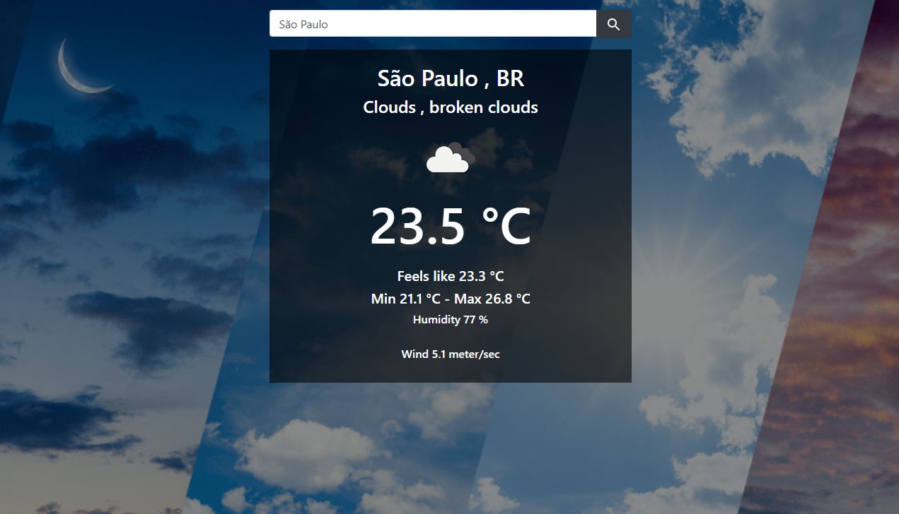

 
<h1 align="center">WEATHER APP</h1>

<!-- TABLE OF CONTENTS -->

## Table of Contents

* [About the Project](#about-the-project)
  * [Built With](#built-with)
* [Run This App](#run-this-app)
* [License](#license)
* [Contact](#contact)
* [Acknowledgements](#acknowledgements)

<!-- ABOUT THE PROJECT -->
## About The Project

The Weather App project uses Asynchronous Javascript for fetching weather data from an API and displaying the forecast.

More about the <a href="https://openweathermap.org/current#current_JSON">API</a>.

Full task description: <a href="https://www.theodinproject.com/courses/javascript/lessons/weather-app"> Odin Project.</a>

For a live version click [here](https://felipeenne.github.io/weather-app/).

### Built With 

* HTML
* CSS
* Git
* Github
* JavaScript
* API
* Bundled with Webpack
* Linted with ESLINT

## Run This App

Just open the dist/index.html file.

## License

Distributed under the MIT License. See `LICENSE` for more information.

<!-- CONTACT -->
## Contact
Felipe Enne Mendes Ribeiro
* Email - felipeenne@gmail.com
* <a href="https://www.linkedin.com/in/felipe-enne/" target="_blank">LinkedIn</a>
* <a href="https://felipeenne.com/" target="_blank">Portfolio</a>

<!-- ACKNOWLEDGEMENTS -->
## Acknowledgements

* <a href="https://www.microverse.org/"> Microverse</a>  and <a href="https://www.theodinproject.com/"> Odin Project</a> .
