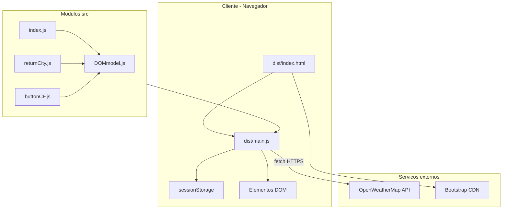
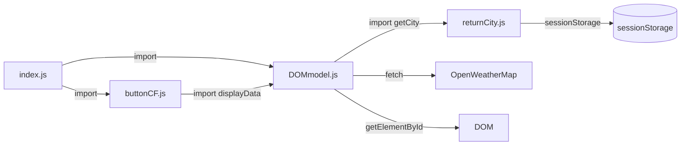

# Arquitetura — Weather App

## Visão geral

O Weather App é uma aplicação **100% client-side**. Todo o processamento ocorre no navegador: captura da cidade, chamada à API externa, conversão de unidades e renderização no DOM. Não existe servidor próprio, workers, filas ou banco de dados.

## Componentes

| Camada | Onde fica | Descrição |
|--------|-----------|-----------|
| Apresentação | `dist/index.html`, `dist/assets/css/style.css` | HTML estático e estilos |
| Lógica / orquestração | `src/index.js` | Bootstrap da aplicação |
| Regras de negócio | `src/DOMmodel.js` | Fetch, conversão Kelvin→°C/°F, render |
| Estado de sessão | `src/returnCity.js` + `sessionStorage` | Nome da cidade |
| Interação | `src/buttonCF.js`, `src/returnCity.js` | Event listeners |
| Build | `webpack.config.js` | Empacota ES modules em um bundle |
| API externa | OpenWeatherMap | Fonte de dados meteorológicos |

## Padrão arquitetural

O projeto segue um padrão simples de **módulos ES6 + manipulação direta do DOM**, sem framework reativo. A separação é funcional (por arquivo), não por camadas formais:

- Não há camada de serviço separada da view.
- Não há gerenciamento de estado centralizado.
- Não há roteamento.

Isso é típico de projetos educacionais pequenos e facilita o entendimento inicial, mas limita escalabilidade.

## Comunicação entre módulos

- `index.js` é o único ponto de entrada do bundle.
- `DOMmodel.js` depende de `returnCity.js` para obter o nome da cidade.
- `buttonCF.js` reutiliza `displayData()` de `DOMmodel.js` para alternar unidades.
- `returnCity.js` registra seu próprio listener no botão de busca (side effect no import).

## Onde ficam as regras de negócio

Concentradas em `src/DOMmodel.js`:

- Montagem da URL da API com cidade e appid.
- Conversão de Kelvin para Celsius (`temp - 273`) e Fahrenheit (`1.8 * (temp - 273) + 32`).
- Formatação e exibição dos dados no DOM.
- Controle de visibilidade do painel de resultados (`#output-data`).

A persistência da cidade está em `src/returnCity.js` (gravação/leitura do `sessionStorage`).

## Integrações externas

### OpenWeatherMap

- Endpoint: `GET https://api.openweathermap.org/data/2.5/weather?q={cidade}&appid={key}`
- Modo CORS habilitado na requisição (`mode: 'cors'`).
- A chave da API está hardcoded no código-fonte (ver `docs/TODO_LEGACY.md`).

### Bootstrap (CDN)

- CSS carregado de `maxcdn.bootstrapcdn.com` no `<head>` de `dist/index.html`.
- Usado para classes de formulário (`form-control`, `input-group`, `btn`).

## Deploy

O deploy é feito via **GitHub Pages**, servindo arquivos estáticos da pasta `dist/`. Por isso, `dist/` está versionado no Git — incluindo o bundle `main.js` já compilado.

## Problemas arquiteturais conhecidos

1. **API key no cliente** — qualquer usuário pode inspecionar o bundle e extrair a chave.
2. **Acoplamento DOM + lógica** — `DOMmodel.js` mistura fetch, transformação de dados e manipulação de elementos HTML.
3. **`dist/` versionado** — risco de `src/` e `dist/main.js` ficarem dessincronizados se o build não for executado após mudanças.
4. **Side effects no import** — `returnCity.js` registra event listener ao ser importado, dificultando testes e reuso.
5. **Fluxo de busca incompleto** — salvar cidade não dispara automaticamente novo fetch (ver `docs/FLOWS.md`).
6. **Tratamento de erro insuficiente** — falhas da API podem causar erros em runtime ao acessar propriedades indefinidas.
7. **Mixed content** — ícones do clima usam `http://` em página potencialmente servida via HTTPS.

## Sugestões futuras (sem alterar código agora)

- Extrair camada de API (`weatherService.js`) separada da renderização.
- Mover API key para variável de ambiente injetada no build (ex.: `webpack.DefinePlugin` + `.env`).
- Adotar servidor de desenvolvimento (`webpack-dev-server`) em vez de abrir HTML via `file://`.
- Automatizar build no CI e decidir se `dist/` continua versionado ou é gerado no deploy.
- Introduzir testes unitários com mock de `fetch`.
- Considerar migração para Vite ou ferramenta mais moderna quando houver refatoração maior.
