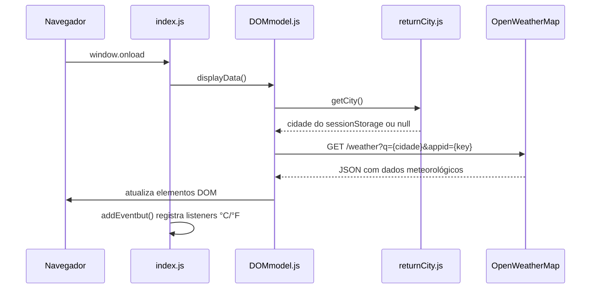
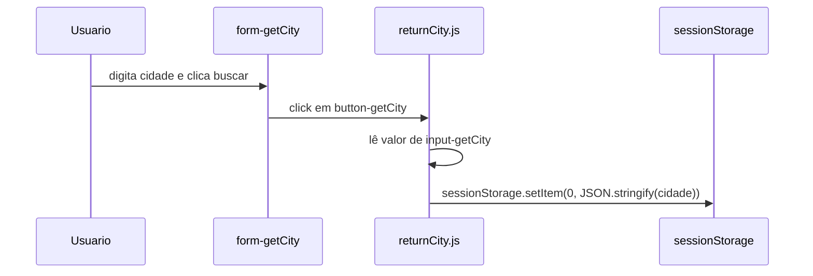
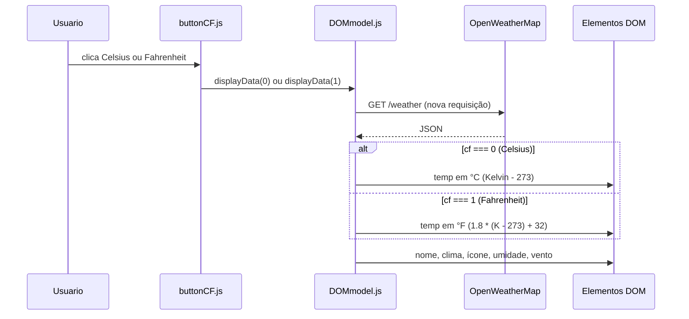

# Fluxos do Sistema — Weather App

## Visão geral

O Weather App possui três fluxos principais: inicialização, busca de cidade e exibição/conversão de temperatura. Não há fluxos de autenticação, cadastro de usuário ou CRUD de entidades.

## Fluxo de inicialização



**Arquivo:** `src/index.js`

```javascript
window.onload = displayData();
addEventbut();
```

Ao carregar a página:

1. `displayData()` é chamada imediatamente (sem aguardar cidade do usuário).
2. `getCity()` lê `sessionStorage` — se vazio, retorna `null`.
3. A API é consultada com a cidade disponível (ou `null` na primeira visita).
4. Os botões Celsius/Fahrenheit recebem event listeners.

## Fluxo de busca de cidade



**Arquivo:** `src/returnCity.js`

- O listener é registrado no clique do botão `#button-getCity`.
- O valor do input `#input-getCity` é serializado com `JSON.stringify` e salvo na chave `0` do `sessionStorage`.

### Limitação conhecida

**Salvar a cidade não dispara novo fetch.** Após buscar, o usuário precisa:
- recarregar a página, ou
- clicar em Celsius ou Fahrenheit (que chama `displayData()` novamente).

O formulário usa `method="GET"` e o botão é `type="submit"` sem `preventDefault`, o que pode causar reload da página em alguns cenários.

## Fluxo de exibição e conversão de temperatura



**Arquivos:** `src/DOMmodel.js`, `src/buttonCF.js`

### Dados exibidos no DOM

| Elemento DOM | Dado da API |
|--------------|-------------|
| `#output-name` | `data.name`, `data.sys.country` |
| `#output-weather` | `data.weather[0].main`, `description` |
| `#output-img` | ícone via `data.weather[0].icon` |
| `#output-temp` | `data.main.temp` (convertido) |
| `#output-feel` | `data.main.feels_like` (convertido) |
| `#output-minmax` | `data.main.temp_min`, `temp_max` (convertidos) |
| `#output-humidity` | `data.main.humidity` |
| `#output-wind` | `data.wind.speed` |

### Conversão de temperatura

- API retorna valores em **Kelvin**.
- Celsius: `parseFloat(temp - 273).toFixed(1)`
- Fahrenheit: `(1.8 * (temp - 273) + 32).toFixed(1)`

### Visibilidade do painel

Se `data.ok === false`, o painel `#output-data` é ocultado (`display: none`). Caso contrário, é exibido. Porém, o código continua processando `data.json()` e acessando propriedades mesmo em caso de erro.

## Fluxo de chamada à API

**Endpoint:**

```
GET https://api.openweathermap.org/data/2.5/weather?q={cidade}&appid={API_KEY}
```

**Headers/opções:**

- `mode: 'cors'`

**Resposta esperada (sucesso):**

```json
{
  "name": "London",
  "sys": { "country": "GB" },
  "weather": [{ "main": "Clouds", "description": "overcast clouds", "icon": "04d" }],
  "main": {
    "temp": 280.32,
    "feels_like": 278.15,
    "temp_min": 279.15,
    "temp_max": 281.15,
    "humidity": 81
  },
  "wind": { "speed": 4.1 }
}
```

## Fluxos não aplicáveis

| Fluxo | Status |
|-------|--------|
| Login / autenticação | Não existe |
| Cadastro de usuário | Não existe |
| CRUD de entidades | Não existe |
| Workers / background jobs | Não existe |
| WebSockets | Não existe |

## Integrações

| Integração | Tipo | Quando é acionada |
|------------|------|-------------------|
| OpenWeatherMap Current Weather | REST API (fetch) | `displayData()` — onload e troca de unidade |
| Bootstrap CDN | CSS externo | Carregamento da página |
| Ícones OpenWeatherMap | Imagem HTTP | Após receber resposta da API |

## Funcionalidade planejada (não implementada)

Conforme `README.md`:

- Favoritar cidade
- Botão de acesso rápido à cidade favorita

Esses fluxos ainda não existem no código.
